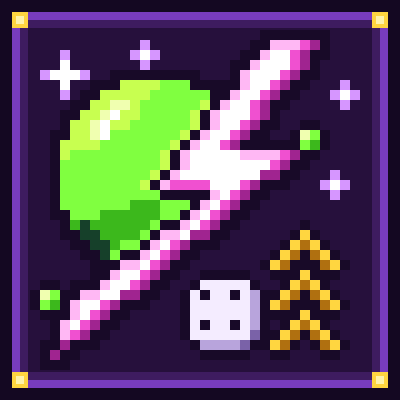

<p align="center">
  
</p>

<h1 align="center">Chaosaholic</h1>

<p align="center"><em>Level up. Unleash chaos. Survive it.</em></p>

Chaosaholic is a Minecraft mode in which each experience level you gain starts a random chaos event: sometimes good,
sometimes bad and sometimes just weird. There are 30 events. Farm XP at your own risk.

It is a Fabric mod for **Minecraft Java Edition 26.2–26.3** (in [`fabric/`](fabric/)).

## What it does

When the mode is on, each experience level a player gains does the following:

1. **Skipped cases:** players in Creative or Spectator. Their level changes never start events.
2. **Only new levels count:** a level counts only if it is above the highest level the player has reached since
   their last death. Levels you spend at an enchanting table, an anvil or a grindstone and then earn back start
   nothing (see [Anti-farming](#anti-farming)).
3. **One level, one event:** three levels at once start three events, one second apart. At most 10 are waiting at a
   time; extra levels beyond that are dropped (so `/xp add @s 1000 levels` doesn't queue 1000 events).
4. **Roll:** one random event from the events that are switched on in this world, weighted by each event's weight.
   Good, Bad and Weird events share one pool. An event that can't start right now (Swap with no mob around, Mob
   Surprise on Peaceful) is rerolled.
5. **Warning (dangerous events only):** TNT Rain, Anvil Rain, Lightning Storm, Mob Surprise and Bee Swarm show a ⚠
   warning on the actionbar and play a rising ping for 3 seconds (4 on Hardcore) before the first hazard.
6. **Start:** Bad events show their name as a title in red with a short subtitle. Good (green) and Weird (purple)
   events show `✦ Name · subtitle` on the actionbar. A sound plays.
7. **Countdown:** a boss bar in the category colour shows the event and the time left (`Speed Demon — 42 s`,
   `m:ss` from one minute). Instant events (Sky Chest, Swap, Random Teleport) just happen, with no bar.
8. **Cleanup:** when the time is up, the event undoes itself (see [Cleanup guarantees](#cleanup-guarantees)).

Levelling up **during** an event rolls another one. Chaos stacks:

- **Different events** run side by side, each with its own boss bar, up to **8** timed events per player. Further
  level-ups wait in the queue until one ends.
- **The same event** rolled again for a player who already has it doesn't start a copy. It **extends** the running
  one by a fresh roll of its duration, announces it again, and never goes past **180 s** remaining.

Difficulty and Hardcore settings are never changed, and events respect them (see
[Hardcore and difficulty](#hardcore-and-difficulty)).

## Notification settings

Every event shows a title or an actionbar line and plays a sound. Each player can turn off either one, and also
screen effects such as the camera wobble of Screen Shake:

- With [Mod Menu](https://modrinth.com/mod/modmenu) installed, open Mods → Chaosaholic → the config button, and
  switch **Event sound**, **Event messages** and **Screen effects**. Every click is saved right away.
- Without Mod Menu, use the client command `/chaosaholic-notify sound|message|effects [on|off]` (without `on|off` it
  flips the setting) or `/chaosaholic-notify status`.

Settings are stored on your computer in `config/chaosaholic.json` (`notifySound`, `notifyMessage`, `screenEffects`;
a missing key means on) and apply on any server that runs Chaosaholic. Players who join without the mod on their
client always get the default title/actionbar and sound, and no camera wobble.

**Boss bars and danger warnings always show and play**, whatever you pick. They are safety information.

## The events

Durations are picked at random from the range each time. "Nearby" means around each affected player, never more
than 24 blocks away. A player can be under at most 8 timed events at once, and an event never has more than 180 s
left, even after extensions.

### 🍀 Good

| Event | What happens | Duration | Safety cap |
|---|---|---|---|
| Midas Hour | Ores you mine drop their loot twice | 60–120 s | Only blocks in the `c:ores` tag, with the right tool, and only when `block_drops` is on. The bonus is a second, independent roll (Fortune rolls again). No bonus for drops that are the ore block itself: Silk Touch and self-dropping ores such as ancient debris get nothing extra, so ore blocks can't be duplicated |
| Feather Fall | You take no fall damage | 60–120 s | Only fall damage is cancelled (ender pearls still hurt). If it ends while you're in the air you get 10 s of Slow Falling to land |
| Loot Piñata | Mobs you kill drop extra random loot | 60–120 s | 1–3 extra stacks of plain survival items per kill (food, ingots, gems, arrows, a rare golden apple or diamond), at most 48 stacks per event. Nothing from mobs spawned by other events, nothing when `mob_drops` is off |
| Speed Demon | Speed III and Haste II | 30–60 s | Both effects end with the event |
| Sky Chest | A chest lands 2–5 blocks from you, filled from a random vanilla structure loot table. It's a normal, permanent chest and it's yours to keep | instant | Only into an empty air block on a safe, solid spot inside the world border, never on you or any other mob. It never replaces a block. Indoors it lands in your room (a spot at your height that you can see wins), not on the roof. No spot, no chest: another event is rolled |
| Double XP | Experience orbs you pick up give twice their points | 60–120 s | Only orbs (not `/xp` or advancements), and only what's left after Mending repaired your gear. The extra XP can level you up, and that rolls another event |
| Healing Aura | Regeneration II | 20–40 s | Ends with the event |
| Iron Skin | Resistance II (40 % less damage) | 30–60 s | Ends with the event |
| Moon Jump | Jump Boost III and no fall damage | 30–60 s | No fall damage for the whole event. If it ends while you're in the air you get 10 s of Slow Falling to land |

### 😈 Bad

| Event | What happens | Duration | Safety cap |
|---|---|---|---|
| TNT Rain | Lit TNT drops around you, one per second per player, each spot marked with smoke first | 15–20 s | 3 s warning (4 s on Hardcore). At most 12 TNT per event, 4–10 blocks away, never within 4 blocks of any player (bystanders included); a TNT is skipped if a player walked up to its spot. Fuse 4 s (5 s on Hardcore). Explosions are power 3 (vanilla TNT is 4), break blocks only when `mob_griefing` is on, and don't happen at all when `tnt_explodes` is off. On Hardcore a blast that would kill you is cancelled and blasts don't push players. Unexploded TNT vanishes at the end |
| Anvil Rain | Anvils crash down on spots near you, one per second per player | 15–20 s | 3 s warning (4 s on Hardcore); each spot is marked with a red dust column 1.5 s before its anvil is released. At most 12 anvils per event, 2–8 blocks away, never within 2 blocks of any player (bystanders included, also when the anvil is released). At most 6 damage per hit (3 hearts), so one anvil can't kill you from full health; on Hardcore a hit that would kill is cancelled. Anvils never become blocks or items |
| Mob Surprise | A wave of hostile mobs shows up and comes for you | 60–90 s | 3 s warning (4 s on Hardcore) with the spawn spots marked. 2 / 3 / 4 mobs on Easy / Normal / Hard (Hardcore counts as Hard), 8–12 blocks away on safe spots, never within 6 blocks of a player. Zombies, skeletons and spiders (husks and spiders in daylight, so nothing burns). No creepers, no jockeys, no baby zombies. They drop no loot or XP (also after turning into a drowned or a stray), call no reinforcements and break no doors. At most 12 alive per event; a wave that would go over that is not announced. Never on Peaceful. Survivors vanish at the end |
| Hunger Games | Hunger III: your food bar drains fast | 30–45 s | Your food level never drops below 1, so you can't starve on any difficulty. Never on Peaceful |
| Butterfingers | Every 5 seconds, a 35 % chance that the stack in your hand slips out | 30–45 s | At most 4 drops per player per event, never in the first 3 seconds. Tossed like pressing Q, or set down at your feet if anything along the throw is lava, fire, cactus or a drop of more than 2 blocks; if even your feet aren't safe (edge of a cliff over lava or the void), nothing slips. Never while you're in the air or in lava. Nothing is destroyed: the items are yours to pick up |
| Eternal Night | Midnight falls at once and holds | 60–120 s | Only in dimensions with a day clock (not the Nether or the End). Sleeping or `/time set` can't skip it (and sleeping doesn't clear the rain either). At the end the clock carries on as if the night had never happened, even on server stop. One Eternal Night per dimension at a time (rolling it again extends it) |
| Lightning Storm | Lightning strikes around you, every 2 seconds per player, each spot sparking first | 15–20 s | 3 s warning (4 s on Hardcore). At most 8 strikes per event, 5–14 blocks away; a strike is skipped if a player is within 4 blocks of its spot. The bolts are **visual only**: flash and thunder, but no damage, no fire, no charged creepers or witches, no changed blocks |
| Sluggish | Slowness II and Mining Fatigue I | 20–40 s | Ends with the event |
| Bee Swarm | Angry bees come after you | 30–45 s | 3 s warning (4 s on Hardcore). 2 / 3 / 4 bees on Easy / Normal / Hard, 4–7 blocks away, at most 4 alive per player. Each bee stings once and then leaves with a puff (no bee dies on you). The poison can't kill, and on Hardcore a sting that would kill is cancelled. They drop no XP, never enter hives, and vanish at the end. Never on Peaceful |
| Blackout | Darkness closes in | 5–10 s | Darkness, not Blindness. Never more than 10 s left, even when rolled again |

### 🌀 Weird

| Event | What happens | Duration | Safety cap |
|---|---|---|---|
| Gravity Flip | You float up (Levitation II, 3 s) and drift down (4 s) by turns | 20–30 s | Slow Falling for the whole event, so every descent is soft. You never rise more than 6 blocks above the ground, the last 5 seconds are always a descent, and if the event ends while you're in the air you get 10 s of Slow Falling to land |
| Chickenpocalypse | Mobs within 12 blocks turn into chickens (babies into chicks) | 30–60 s | At most 16 mobs, nearest first. Players, bosses, pets, named mobs, riders, leashed mobs and mobs holding a leash, mobs in water or lava or in the air, allays, happy ghasts, villagers with a job, wandering traders and player-built iron golems are left alone. Each chicken turns back into the exact mob it was (health, gear, trades…), even after a chunk reload or a crash (next to a spot it doesn't fit in). Only players can hurt the chickens; if a player kills one, the mob is gone for good. The chickens don't breed or lay eggs |
| Tiny World | You and the mobs around you shrink to half size | 30–60 s | Radius 12 blocks, at most 64 mobs. Bosses, pets, named mobs and riders are left alone. Everyone grows back at the end (the change is never saved, so it can't stick) |
| Bouncy Floor | Landing bounces you back up like a slime block | 30–60 s | No fall damage while it lasts. Sneak to land without bouncing. If it ends mid-bounce you get 10 s of Slow Falling to land |
| Upside Down | Mobs within 16 blocks are renamed Dinnerbone and flip upside down | 30–60 s | At most 32 mobs; mobs that walk in later flip too. Players and bosses never flip. The flip name doesn't float above the mobs: you only see it when you look straight at one. Original names come back at the end, even after a crash; a mob you name-tag during the event keeps its new name |
| Swap | You swap places with a random mob within 16 blocks | instant | Only mobs that aren't bosses, pets, named or riding, and only when both spots are safe for both of you. You must see the mob, or it must stand in open space (never a sealed pocket in rock). Speed and fall distance are reset, so the swap can't hurt or save anyone. Not while you ride something. No mob, no swap: another event is rolled |
| Sheep Disco | 3–5 rainbow sheep appear 2–5 blocks around you and dance to a note-block tune | 30–45 s | The sheep can't be hurt, sheared or bred (no free wool, mutton or XP). They leave at the end without dropping anything |
| Slippery | Every block feels like ice, for you and up to 16 mobs within 8 blocks | 30–45 s | Ends with the event (the change is never saved) |
| Random Teleport | You teleport to a random safe spot 8–24 blocks away | instant | Same dimension, a loaded chunk inside the world border, solid floor, no liquid or hazard, open space (never a sealed pocket in rock). Under the open sky you land on the surface, not in a cave below; underground it works in caves and the Nether. You land with no fall damage. No safe spot: another event is rolled |
| Screen Shake | Your camera wobbles | 10–15 s | Client side, at most 1.5°, eased in and out, scaled by your Screen Effects accessibility slider (0 % = no shake). Needs the mod on your client; off if you turned screen effects off |
| Glow Party | You and everything within 16 blocks glow, even through walls | 30–60 s | At most 48 entities; newcomers light up too. Creative and Spectator players are never picked. Ends with the event |

**Fair play:** mobs, TNT, anvils, bees, sheep and lightning bolts that events spawn are never saved with the world:
when the event ends, the chunk unloads or the server crashes, they're gone. None of them can be farmed: Mob Surprise
mobs and bees drop no loot or XP, disco sheep can't be hurt, sheared or bred, anvils never become items, Loot Piñata
has a per-event cap and Midas Hour never doubles ore blocks. Effects given by an event come back if you drink milk,
until the event ends.

## Rules of the chaos

### Anti-farming

Each player has a **mark**: the highest experience level they have reached since their last death. It is saved with
the player (`chaosaholic:level_mark`). Only levels **above the mark** start events:

- You reach level 30 (30 events so far). You spend 20 levels enchanting and earn them back: levels 11–30 start
  nothing. Level 31 starts the next event. The same goes for anvils and the grindstone.
- Losing levels never starts anything and never lowers the mark.
- Levels gained while the mode is off, or in Creative or Spectator, still raise the mark. Turning the mode on later
  doesn't release a backlog.
- The first time the mod sees a player (a world from before the mod, a new player joining), the mark is set to their
  current level. Nothing floods.
- **Death resets the mark.** The respawned player starts a new mark at their level after respawning. Normally that
  is 0, so every level you earn back counts again: dying is the price. With the `keep_inventory` game rule on you keep
  your levels, so the new mark is the level you respawn with. Levels you had spent before dying (say you reached 30,
  spent down to 10, then died) count again when you earn them back.
- Double XP can level you up, and those levels count like any other. That's the point.

### Scope

`/chaosaholic scope player|world` decides who an event hits. It is saved per world.

- **player** (default): only the player who levelled up.
- **world**: every eligible player (Survival or Adventure, alive) **in the same dimension** as the player who
  levelled up, at the moment the event starts. Players in other dimensions aren't affected, and players who arrive
  later don't join it. Everyone who already has that event gets it extended; everyone who already has 8 events is
  skipped.

### Who is affected

Only players in Survival or Adventure mode who are online and alive. A player drops out of an event, and every
change it made to them is undone right away, when they:

- switch to Creative or Spectator,
- die,
- log out,
- change dimension.

The event keeps running for everyone else and ends once no one is left. A player's pending level-ups are cleared on
death, when they switch to Creative or Spectator, and when the mode is switched off.

### Hardcore and difficulty

Bad events never make a death unavoidable:

- every hazard (TNT, anvils, lightning, mobs, bees) comes after a 3-second warning, 4 seconds on Hardcore, and
  TNT, anvil and lightning spots are marked before anything lands;
- hazards land around you, never on your spot or next to any other player: a TNT, anvil or bolt whose spot a player
  walked up to is skipped;
- one anvil hit deals at most 6 damage, lightning is visual only, and Hunger Games never lets you starve;
- on Hardcore, a TNT blast, anvil hit or bee sting that would kill you is cancelled, TNT blasts don't push you,
  and TNT fuses are a second longer;
- movement events end in a safe state (Gravity Flip always ends on slow falling; leaving Moon Jump, Feather Fall, Bouncy Floor or Gravity Flip in mid-air gives 10 s of Slow Falling);
- Mob Surprise, Bee Swarm and Hunger Games never start on Peaceful. Difficulty sets the wave and swarm size, and
  Hardcore counts as Hard;
- `mob_griefing` decides whether TNT Rain breaks blocks, and `tnt_explodes` off means it doesn't explode at all.

### Cleanup guarantees

Every temporary change goes through the framework, never through an event's own cleanup code, so nothing is left
behind:

| When | What happens |
|---|---|
| The timer runs out | The event ends and undoes everything |
| `/chaosaholic off` or `/chaosaholic stop` | Every running event (or the targets' events) ends at once, with full cleanup |
| The server stops | Every event ends before the final save |
| A player logs out, dies, changes dimension or goes Creative/Spectator | That player's effects, size and other changes are removed |
| A chunk unloads | Spawned mobs, TNT and sheep vanish (they're never saved). Size changes are never saved either |
| The server crashes | On the next start: spawned entities are gone, chickens turn back into their original mobs, renamed mobs get their names back, and temporary blocks are put back to what they were |
| An event throws an error | It is logged once, and the event is stopped and cleaned up like any other |

Effects are removed at the end unless you had a longer one of your own. Rewards are real, though: Sky Chest's chest,
Midas Hour's ores, Loot Piñata's drops and Double XP's experience are yours to keep.

## Commands

`/chaosaholic` is for operators (permission level 2, like `/gamerule`). In single-player it needs cheats: Allow
Commands on, or Open to LAN with Allow Cheats on.

| Command | What it does |
|---|---|
| `/chaosaholic [on\|off\|status]` | Turns Chaosaholic Mode on or off for this world. Plain `/chaosaholic` or `status` shows the mode and the active events. `off` also ends every running event |
| `/chaosaholic scope [player\|world]` | Sets who an event hits (see [Scope](#scope)). Without an argument, shows the current scope |
| `/chaosaholic events` | Lists all 30 events with their category, on/off and weight. Hover for a description, click to fill in `/chaosaholic event <id> ` |
| `/chaosaholic event <id> [on\|off\|status]` | Switches one event on or off for this world, or shows it |
| `/chaosaholic event <id> weight [0..1000]` | Sets how often an event is rolled compared to the others (default 100, 0 = never). Without a number, shows the weight |
| `/chaosaholic trigger <id> [targets]` | Starts that event now, even if the mode or the event is off. Still refuses players in Creative/Spectator, players with 8 events, and events that can't start there |
| `/chaosaholic roll [targets]` | Rolls a random event now, as a level-up would (switches and weights apply), even if the mode is off |
| `/chaosaholic stop [targets]` | Ends every event affecting the targets, with full cleanup |

Targets default to yourself. Command results (for command blocks): `on`/`off`/`status` return 1 for ON and 0 for
OFF; `trigger`, `roll` and `stop` return how many events they started or stopped.

Client command, for any player with the mod on their client: `/chaosaholic-notify status` and
`/chaosaholic-notify sound|message|effects [on|off]` (see [Notification settings](#notification-settings)).

Settings are stored per world in `data/chaosaholic/settings.dat`: the mode, the scope, and each event's on/off and
weight.

## Install

1. Install [Fabric Loader](https://fabricmc.net/use/) for Minecraft 26.2 or 26.3, and run the game on Java 25.
2. Put [Fabric API](https://modrinth.com/mod/fabric-api) and `chaosaholic-<version>.jar` in your `mods/` folder. Get
   the jar from [GitHub releases](https://github.com/nezo32/chaosaholic/releases) or CurseForge.
   Optional: [Mod Menu](https://modrinth.com/mod/modmenu) for the settings screen.
3. Turn the mode on in one of two ways:
   - **New world:** Create World → Game tab → **Chaosaholic Mode** (right below Difficulty) is **ON** by default
     (switch it off there for a normal world).
   - **Existing world or dedicated server:** an operator runs `/chaosaholic on` (`/chaosaholic status` shows the
     current state). Worlds made without the button (dedicated servers, other launchers, worlds from before the mod)
     start with it off.

The mod is needed on the server. On the client it adds the Create World button, the settings screen and the camera
wobble; players without it can still join and play.

## Known quirks

- Double XP can level you up, and a level-up rolls another event. XP farms get *very* lively.
- Eternal Night moves the clock of the whole dimension, so every player there gets the night, not only the affected
  ones. Nobody can sleep it away while it lasts. If the server crashes during it, the clock simply carries on from
  that night.
- Screen Shake is invisible without the mod on your client (or with screen effects off): you only get the boss bar
  and the sound.
- Upside Down renames mobs to Dinnerbone for a while (you see the name when you look straight at a mob). Pets and
  name-tagged mobs flip too; their names come back at the end.
- Chickenpocalypse chickens keep the original mob inside them: kill the chicken and the mob is gone for good, and
  you only get what a chicken drops, not the mob's gear. Nothing else can hurt them (only the void and `/kill`).
- Butterfingers drops can land where other players or mobs pick them up. Pick yours up quickly.
- Tiny World uses vanilla's scale attribute, so your reach and step height shrink with you.
- TNT Rain follows the `mob_griefing` game rule: with it on, the TNT breaks blocks like normal TNT.
- Milk only helps for a second: an event's effects come back until the event ends.
- A player with 8 running events keeps their level-ups in the queue (up to 10); the queue lives in memory, so pending
  level-ups are lost when the server stops.

## Repository layout

| Path | Contents |
|---|---|
| `fabric/` | Java Edition Fabric mod (Gradle), see [fabric/README.md](fabric/README.md) |
| `.github/workflows/` | CI (`ci.yml`), release (`release.yml`) and the reusable `reusable-*.yml` workflows |
| `scripts/` | CurseForge upload script and its tests |
| `docs/ci/` | Release runbook and reusable pipeline docs |
| `docs/branding/` | Logo, palette, player-facing strings, CurseForge page |

## Development

Needs JDK 25. Gradle can also run on Java 21 and download a JDK 25 toolchain.

```bash
cd fabric
./gradlew build                   # Minecraft 26.3: compile, JUnit, server GameTests; jars in build/libs/
./gradlew clean build -Pmc=26.2   # the same against 26.2
```

One jar runs on both 26.2 and 26.3. The Create World button is covered by a client GameTest (`./gradlew
runClientGameTest`). It needs a display (for example Xvfb), so `build` and CI don't run it.

Adding an event is one class, one registration line, lang entries and a GameTest: see
[CONTRIBUTING.md → Adding a new event](CONTRIBUTING.md#adding-a-new-event). Branch names, PR rules and the full list
of local checks are in [CONTRIBUTING.md](CONTRIBUTING.md).

## Releasing

To release, push an annotated `vX.Y.Z` tag on a commit of `main` (pre-releases use `-alpha.N`, `-beta.N` or `-rc.N`).
`release.yml` then does the rest:

1. Builds and tests the jar, stamping the tag's version into it.
2. Creates the GitHub release with notes generated from PR titles and labels.
3. Uploads the jar to CurseForge.

Don't edit the version in `fabric/gradle.properties` by hand. The tag sets the version.

- Maintainer runbook: [docs/ci/RELEASING.md](docs/ci/RELEASING.md)
- How the reusable pipeline works and how other projects can use it:
  [docs/ci/REUSABLE_RELEASE_PIPELINE.md](docs/ci/REUSABLE_RELEASE_PIPELINE.md)

## License

[MIT](LICENSE) © 2026 nezo
